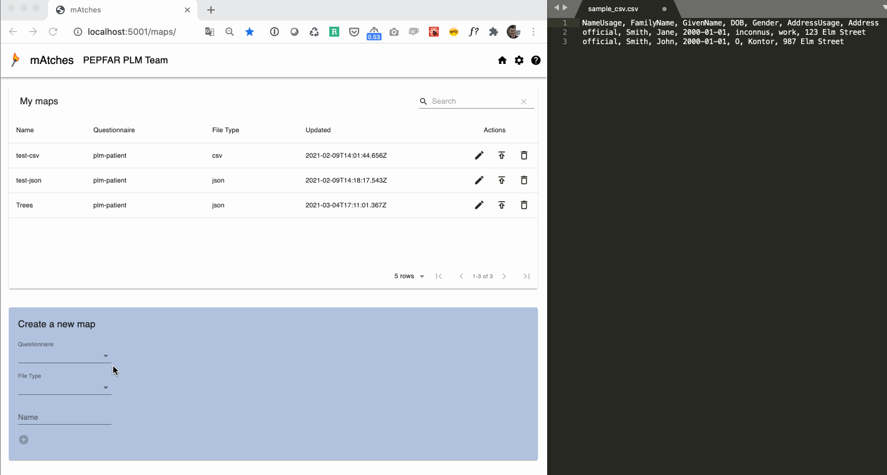
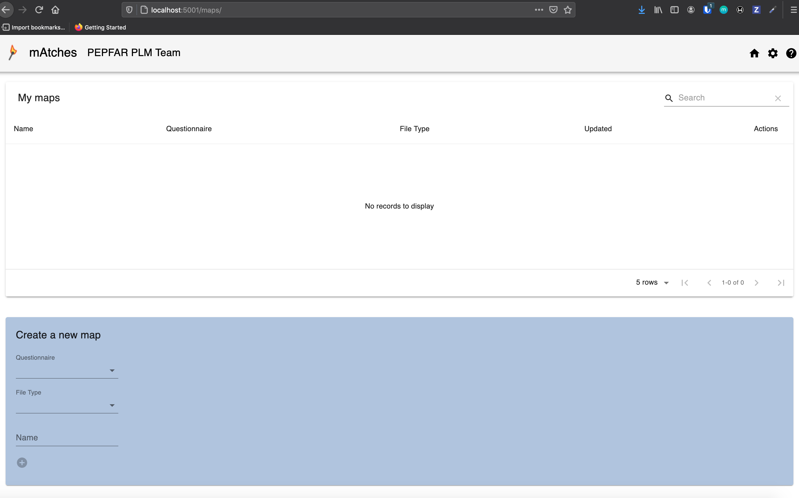

# mAtches

Data source to target mapping utility

**Repo Owner:** Annah Ngaruro [@angaruro](https://github.com/angaruro)

## High-level Overview

mAtches is a tool that improves and facilitates exchange of data using, FHIR standards. Data experts can define data requirements for one or more indicators using FHIR Questionnaires. Non-techinical users can then map their proprietary data using mAtches' intuitive, easy-to-follow UI and generate a FHIR resource (bundle of questionnaire responses) allowing downstream systems consume their data in a consistent and compliant format.

mAtches is part of PEPFAR's Data Aggregation Service for Health (DASH) architecture which is exporing ways to facilitate data exchange and allow for easy aggregation of patient-level data. DASH is a project within PEPFAR's Data Use Community.

**Please note mAtches has been developed as a proof-of-concept project. We are working to productize mAtches to make it more generally accessible and more technically robust.**

## "Demo"

The below gif shows the basic functionality of the mAtches app and shows how a csv file can be mapped to an questionnaire which defines data requirements. Demo shows some basic error handling by showing what happens if you forget to map one of the values where the questionnaire anticipates a limited number of options.



## Documentation

Documentation, both technical and end-user, is available at: https://pepfar-datim.github.io/mAtches/. We are currently working on writing a FHIR ImplementationGuide, which will detail use of FHIR resources and also include technical documentation.

## Roadmap

- **User Management/Authentication:** We are working to develop and incorporate a User Management system into mAtches including SSO authentication and user authorization/access controls.

- **Technical Architecture Review/Upgrade:** Because of the proof-of-concept nature of this product, the initial implementation put less emphasis on technical robustness. As part of our efforts to productize mAtches, we will be revisiting technical architecture, cleaning up or rewriting existing the code base, and adding automated testing.

- **Customization/Deployability:** mAtches has a goal to be user-friendly and this extends to implementation. We plan to provide  options for easy customization and deployment for implementers. We are exploring integrating mAtches into existing technology suites to ease requirements surrounding deployment.

- **Solicitation of Community Feedback:** This product is conceptualized as a general purpose tool for partners in the global health community. If you are interested in using mAtches for standards-compliant data exchange or if you'd like to provide feedback, we'd be happy to hear from you.

## Running mAtches locally

A. Clone repo.
mAtches App is configured to run on port 5001, to change this, edit [line 10 of config.json](config.json#L10) file

B.1 Update config.json file
Change any settings (organization name, appName, FHIR Server) in the [config.json](config.json) file. A summary of configuration options is provided below:

- _base_: If this is "/", mAtches will run at http://localhost:5001/. If this is "/some/other/extension/", mAtches will run at http://localhost:5001/some/other/extension/. Should end in `/`.
- _name_: This name will appear in the top-left corner and is the name of the organization/instance for instance of mAtches.
- _appName_: This name will appear in the top-left corner. If you use 'mAtches' here, the app will be named mAtches, but you can also rename.
- _allowExternalURL_: This is a boolean value (true/false). This property would allow you to send a bundle of questionnaireResponses to an external URL (note this feature is being deprecated)
- _externalMappingLocation_: This is the name for an external mapping location. It appears in the button which reads "SUBMIT TO {NAME}".
- _externalMappingLocationURL_: This is the URL for an external mapping location (i.e. where the map will be sent when you hit "Submit"). Should end in `/`. You can use the default here for sandbox testing.
- _fhirServer_: FHIR server where questionnaires are stored. Should end in `/`. Should end in `/`. You can use the default here for sandbox testing.
- _persistencyLocation_: Where maps are persisted locally before they are submitted to external location. Should end in `/`. See notes below for further details on configuring this.

B.2 Create `maps` folder and an empty json file `maps/maps.json` in _persistencyLocation_ : 

The default location of _persistencyLocation_ in [config.json](config.json#L9) is `/usr/local/mAtches/data/`. Regardless of whether you use this default persistency location, or if you choose to configure another location, **you must create a `maps` subdirectory within this location and initiate an empty maps.json file within that `maps` subdirectory.**

If you are using a Unix machine, the following commands can be used to set up the persistency storage (assuming you already have a `/usr/local` directory and wish to use the default location). Note that depending on your settings you may need to run some or all of these commands with `sudo ` before the beginning of the command.

```bash
cd /usr/local/ #go to /usr/local/
mkdir mAtches && cd $_ #create mAtches directory and go there
mkdir data && cd $_ #create data subdirectory and go there
mkdir maps #create maps subdirectory
chmod a+rw maps #give users ability to read/write from files within maps subdirectory
echo "{}" > maps/maps.json #create empty maps.json file
```

C. Set up and start frontend
<br/>

1. Make sure you are in the root directory of mAtches repo you have cloned in `Step A`
2. Install dependencies `npm install`

3. Run app `npm start`

4. Confirm mAtches app has started properly by

   - 4.1 Confirm the terminal is showing a similar message `App running on port 5001`.
   - 4.2 Open a browser and search for `base:port` by default that would be http://localhost:5001/
   
   - 4.3 Confirm if step B2 is setup properly by clicking on mAtches logo or the home icon if the link reloads the above page, the setup is successful.


D. Troubleshooting

- `file not readable` Error - 
If you see an error similar to the following in the terminal. Please make sure you setup step `B.2` properly.
        
   ```
   [Error: ENOENT: no such file or directory, open '/usr/local/mAtches/data/maps.json'] {
      errno: -2,
      code: 'ENOENT',
      syscall: 'open',
      path: '/usr/local/mAtches/data/maps.json'
      }
      /mAtches/server/queries.js:34
      reject(new Error("file not readable"));
               ^
   Error: file not readable
   at ReadFileContext.callback (/mAtches/server/queries.js:34:16)
   at FSReqCallback.readFileAfterOpen [as oncomplete] (node:fs:284:13)
   [nodemon] app crashed - waiting for file changes before starting...

   ``` 